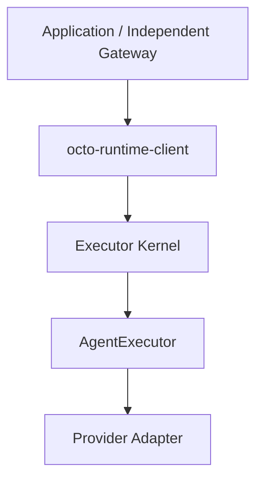

# 架构

[English](../../en/concepts/architecture.md)

Runtime 提供通用执行，应用持有业务数据和生命周期。

```mermaid
flowchart TB
  App[Application / Independent Gateway] --> Client[octo-runtime-client]
  Client --> Kernel[Executor Kernel]
  Kernel --> Core[AgentExecutor]
  Core --> Adapter[Provider Adapter]
```

Gateway 为独立仓库，配置、授权、上下文、会话和投递由其负责。关闭业务注册不停止共享 Kernel。

执行事件信封保持原格式；业务材料由 Gateway/应用准备 inputs，agentEnv 仅包含执行配置。
